# FindMyCrib UI

[](https://vite.dev/)
[](https://react.dev/)
[](https://developer.mozilla.org/en-US/docs/Web/JavaScript)
[](./LICENSE)

AI-powered real estate intelligence frontend for discovering properties, checking price competitiveness, comparing options, estimating affordability, and booking site visits.

> Demo video / YouTube link: <!-- Insert demo video or YouTube link here -->

> All commands below assume you are inside `frontend/`, which contains the Vite application.

## Table of Contents

- [Project Overview](#project-overview)
- [Features](#features)
- [Tech Stack](#tech-stack)
- [Architecture / Workflow](#architecture--workflow)
- [Screenshots / Media Placeholders](#screenshots--media-placeholders)
- [Installation](#installation)
- [Usage](#usage)
- [Project Structure](#project-structure)
- [Results](#results)
- [Future Improvements](#future-improvements)
- [Contributors](#contributors)
- [License](#license)

## Project Overview

FindMyCrib is a dark-themed, single-page React application built to help users explore residential properties and move through a guided decision flow:

1. Discover properties in the Explore view.
2. Inspect price intelligence and risk signals.
3. Compare up to three shortlisted properties.
4. Estimate financing impact with EMI and affordability analysis.
5. Book a site visit with a validated form and confirmation state.

The current build is frontend-first. Data is served from local mock sources by default, while the service layer already defines request/response contracts for future n8n or API integration.

## Features

- Hero landing screen with a high-contrast product introduction.
- Property exploration with search, filters, and live suggestions.
- Property detail modal with richer amenities and summary information.
- Shortlist and compare workflow with a maximum of three properties.
- Price intelligence screen with price status, estimated range, risk level, and AI-style insight copy.
- Financial analysis screen with EMI calculation, affordability assessment, and investment rating.
- Visit booking flow with form validation and confirmation feedback.
- Session-backed state retention for search results and compare selections.
- Animated backgrounds and three-dimensional presentation layers using `three`, `@react-three/fiber`, `@react-three/drei`, and `tsparticles`.

## Tech Stack

| Area | Technology |
| --- | --- |
| Framework | React 19 |
| Build Tool | Vite 8 |
| Language | JavaScript (ES modules) |
| Styling | Plain CSS, theme tokens, component-level styles |
| 3D / Motion | `three`, `@react-three/fiber`, `@react-three/drei` |
| Visual Effects | `@tsparticles/react`, `tsparticles` |
| Charts | `recharts` |
| State / Persistence | React state, `sessionStorage` |
| Tooling | ESLint, Vite dev server, Vite preview server |

## Architecture / Workflow

FindMyCrib is implemented as a section-driven single-page experience rather than a routed app. Navigation state lives in the main layout and controls which view is rendered.

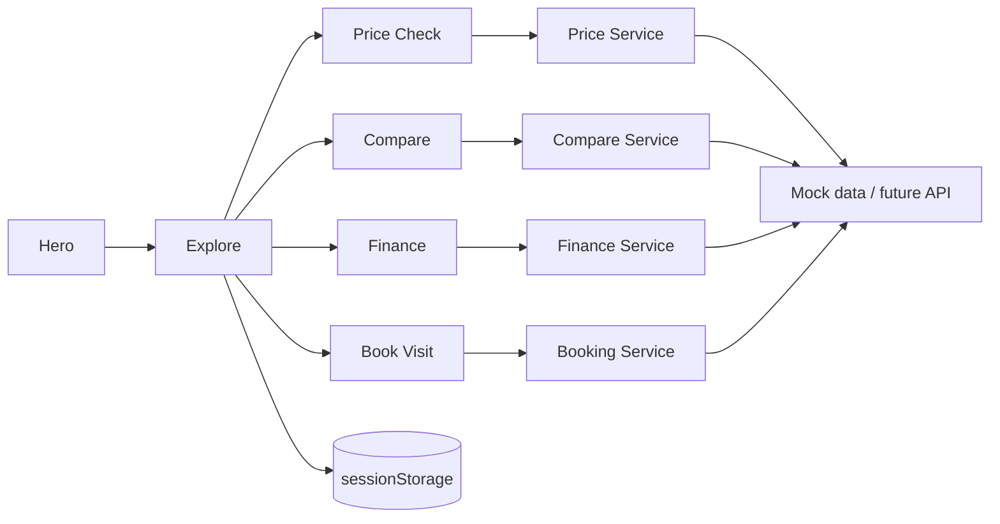

Implementation notes:

- `frontend/src/layouts/MainLayout.jsx` controls the active section and shared state.
- `Explore` passes the selected property into the other feature screens.
- `sessionStorage` is used to preserve the latest explore results and compare list across navigation.
- The service layer is organized as agent-style adapters that can either read local mock data or call a webhook/API later.
- The app currently runs in mock mode by default, so the UI is fully usable without a backend.

<!-- Insert Architecture Diagram here -->
<!-- Insert state flow diagram, system overview, or service contract diagram here -->

## Screenshots / Media Placeholders

Use the placeholders below if you want to add project images to the repository later. The README remains readable even if these assets are not present.

<h3 align="left">Hero</h3>

<p align="center">
  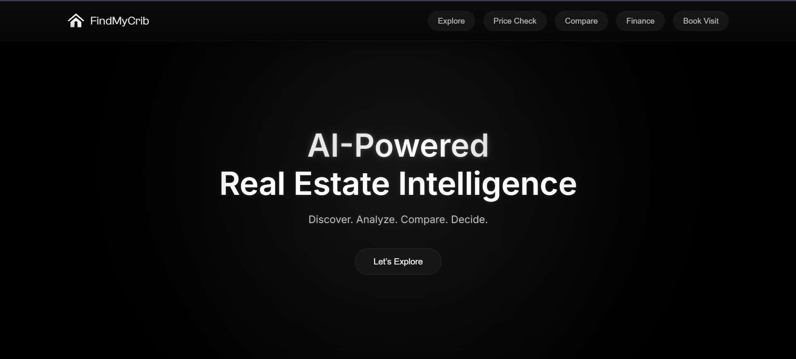
</p>


<h3 align="left">Explore</h3>

<p align="center">
  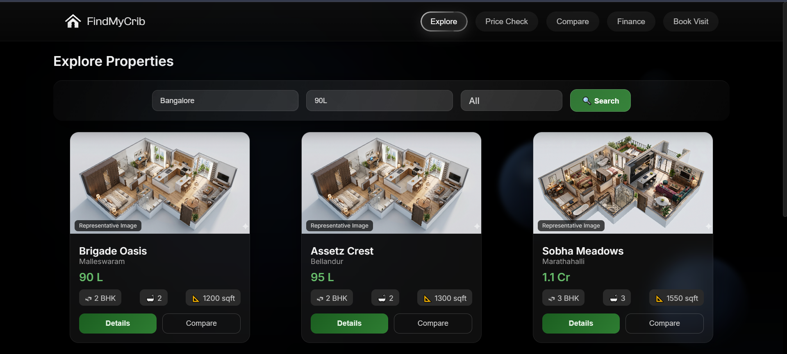
  <br><br>
  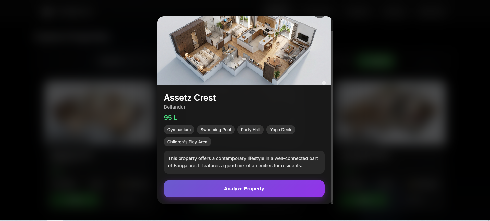
  <br><br>
  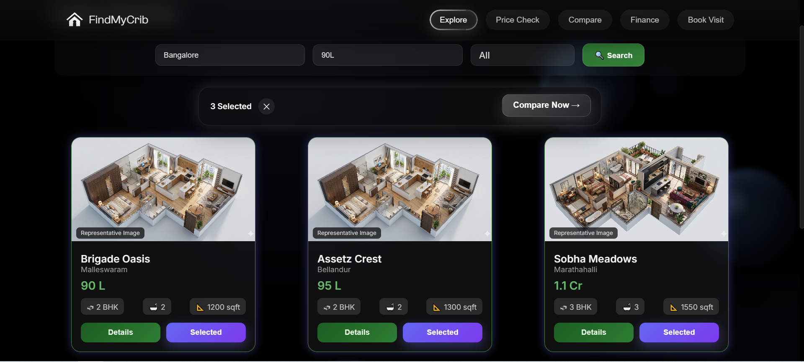
</p>

<h3 align="left">Price Check</h3>

<p align="center">
  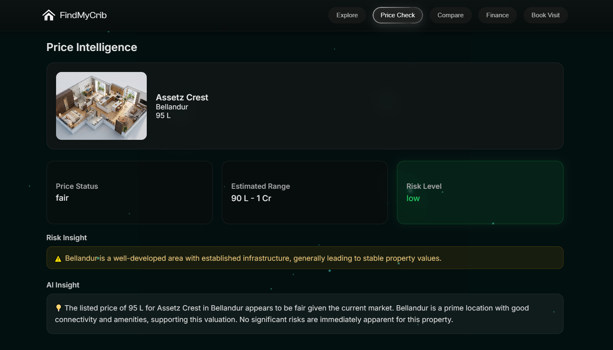
</p>

<h3 align="left">Compare</h3>

<p align="center">
  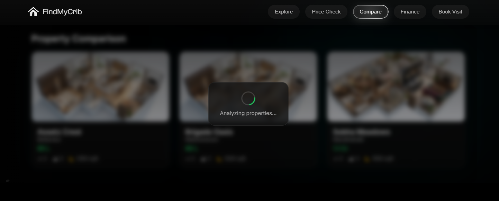
  <br><br>
  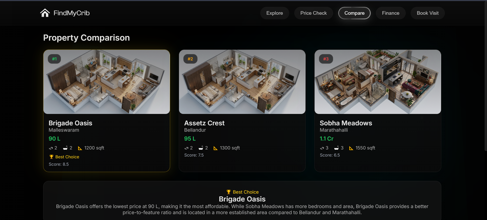
  <br><br>
  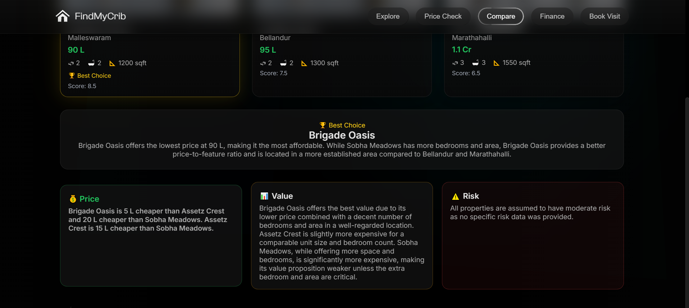
</p>

<h3 align="left">Finance</h3>

<p align="center">
  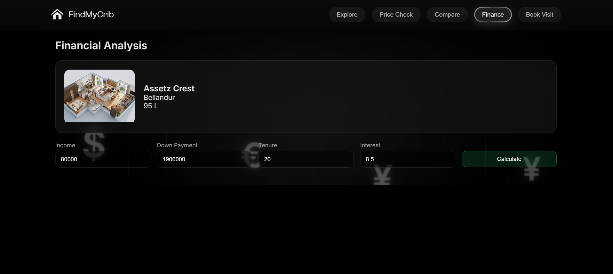
  <br><br>
  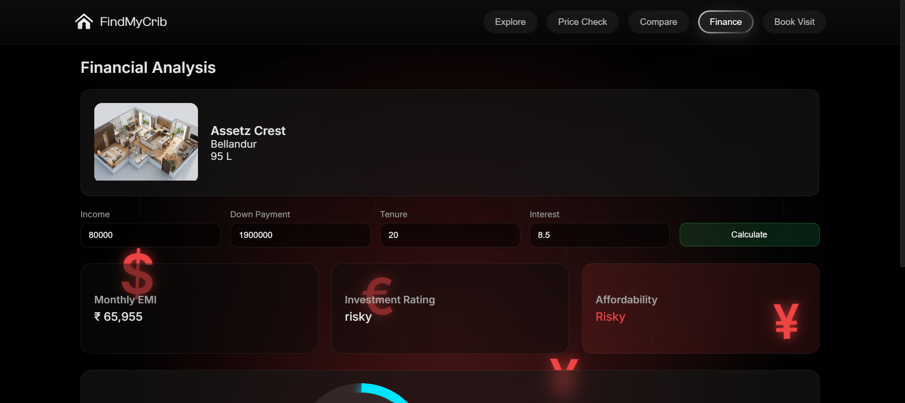
  <br><br>
  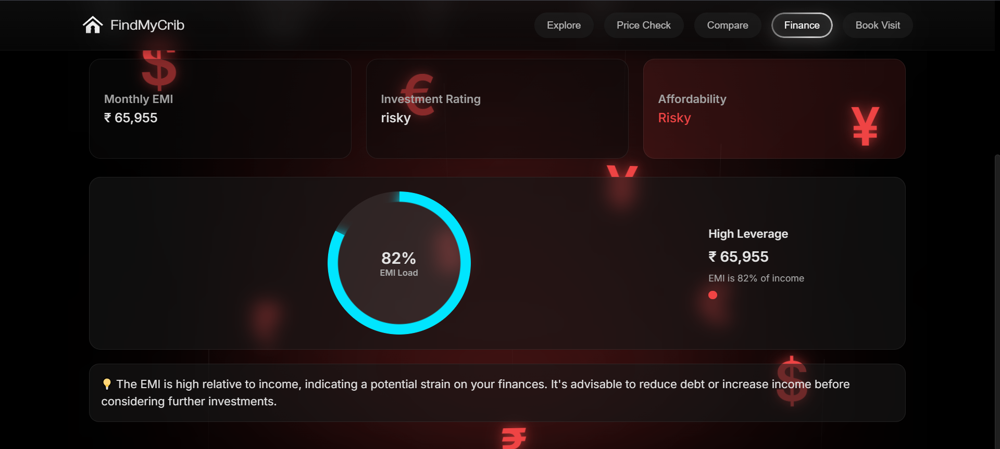
</p>

<h3 align="left">Book Visit</h3>

<p align="center">
  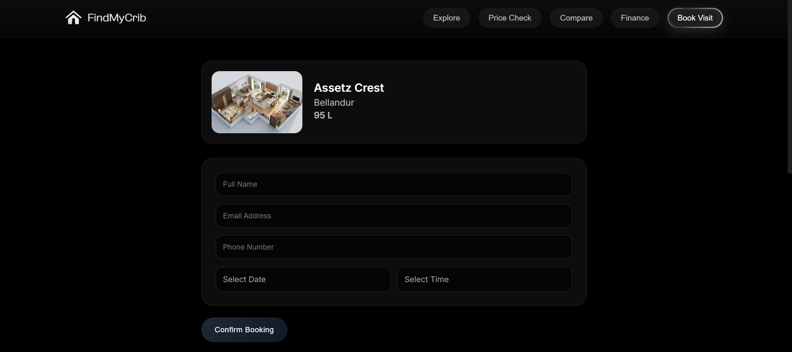
  <br><br>
  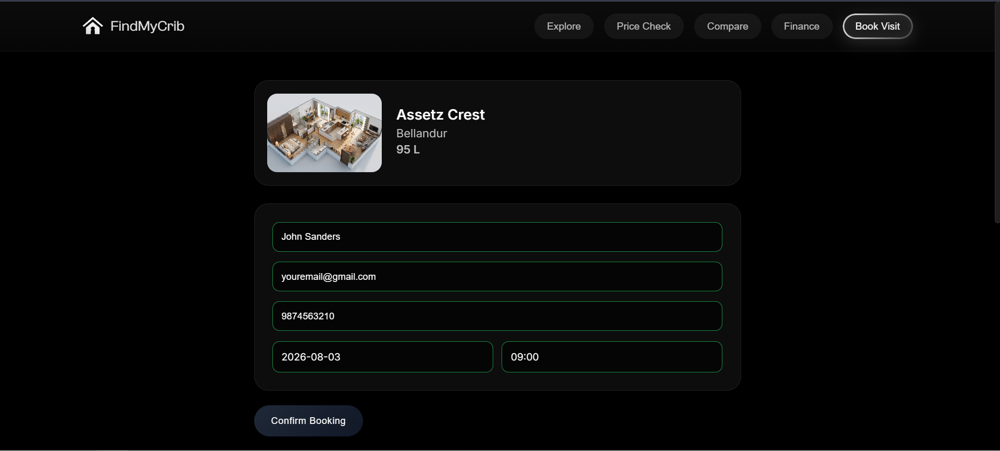
  <br><br>
  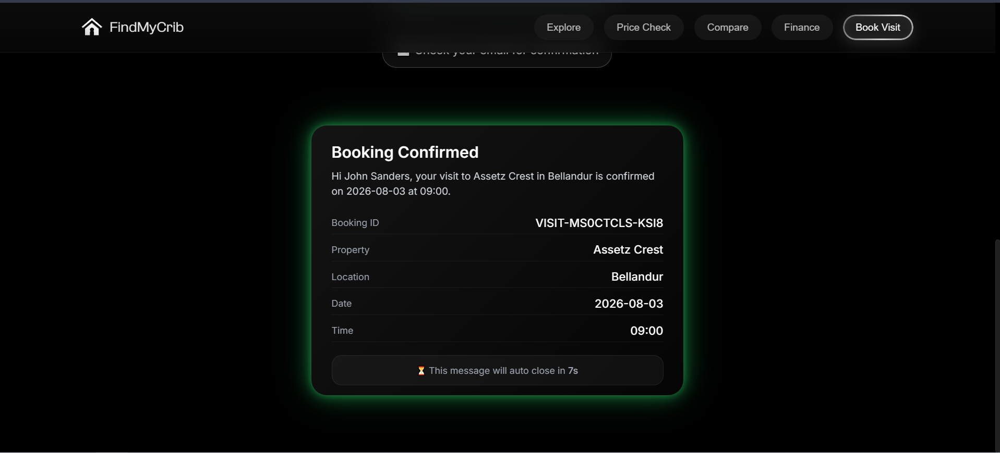
</p>

### GIF / Video

<!-- Insert demo GIF here -->
<!-- Insert demo video / YouTube embed link here -->

## Installation

### Prerequisites

- Node.js 20 or newer is recommended.
- npm is included with Node.js.

### Setup

```bash
git clone <repository-url>
cd findmycrib-ui/frontend
npm install
```

### Run locally

```bash
npm run dev
```

### Build for production

```bash
npm run build
```

### Preview the production build

```bash
npm run preview
```

## Usage

1. Open the app in your browser after starting the dev server.
2. Begin on the Hero screen and move into Explore.
3. Search by location, budget, and property type.
4. Open a property card to review details or add it to the compare list.
5. Switch to Price Check, Finance, or Book Visit after selecting a property.
6. Submit the booking form to view the confirmation state.

## Project Structure

```text
findmycrib-ui/
|-- README.md
|-- LICENSE
|-- DOCUMENTATION.md
`-- frontend/
    |-- package.json
    |-- public/
    |   |-- assets/
    |   |-- favicon.svg
    |   `-- icons.svg
    `-- src/
        |-- assets/
        |-- components/
        |-- config/
        |-- data/
        |-- layouts/
        |-- pages/
        |-- services/
        |-- styles/
        |-- utils/
        |-- App.jsx
        `-- main.jsx
```

Key folders:

| Folder | Purpose |
| --- | --- |
| `src/pages/` | Top-level feature screens such as Hero, Explore, Price Check, Compare, Finance, and Book Visit |
| `src/components/` | Reusable UI building blocks, cards, overlays, scenes, and navigation |
| `src/services/` | Request adapters and mock/API contracts for property analysis and booking |
| `src/data/` | Local property and location datasets used by the mock experience |
| `src/utils/` | Formatting, debouncing, image mapping, caching, and normalization helpers |
| `src/styles/` | Global theme and shared style tokens |

## Results

The current implementation delivers these working outcomes:

| Screen | Result |
| --- | --- |
| Hero | Brand-forward landing view with a clear call to action |
| Explore | Searchable property discovery with shortlist support |
| Price Check | Price evaluation with risk and value summary |
| Compare | Side-by-side ranking of up to three properties |
| Finance | EMI and affordability analysis for decision support |
| Book Visit | Form validation and booking confirmation flow |

The interface is fully usable in mock mode and demonstrates the intended product experience without requiring a live backend.

## Future Improvements

- Replace mock data with live API or n8n webhook responses.
- Move runtime configuration fully into environment variables.
- Add URL routing so sections can be deep-linked.
- Add automated tests for the compare, finance, and booking workflows.
- Introduce accessibility pass improvements for keyboard navigation and screen readers.
- Add deployment scripts and a documented production hosting target.
- Add a persistent backend for booking storage and analytics.

## Contributors

- Charan M - frontend design, implementation, and product workflow integration

If more contributors join later, list them here with their roles and links.

## License

This project is proprietary. See [LICENSE](./LICENSE) for the usage terms.

---

For implementation-level documentation, see [DOCUMENTATION.md](./DOCUMENTATION.md).
